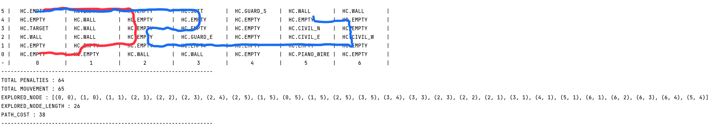
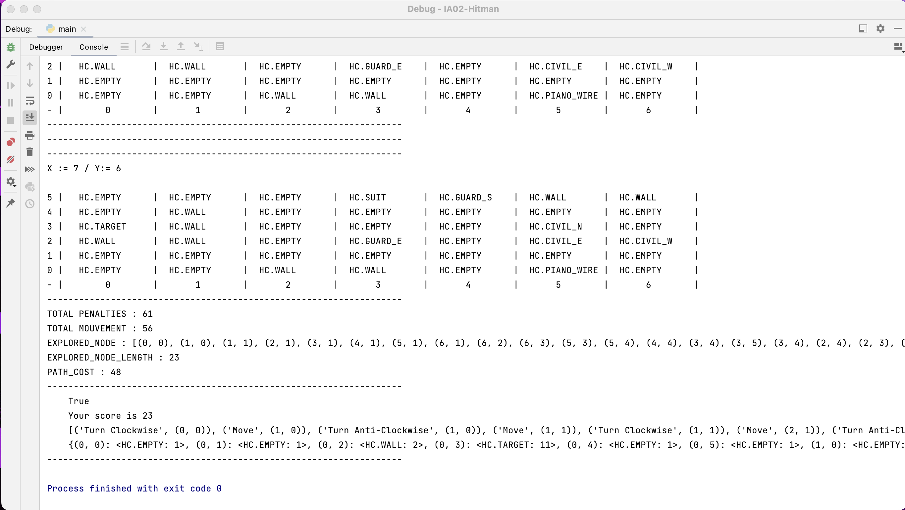
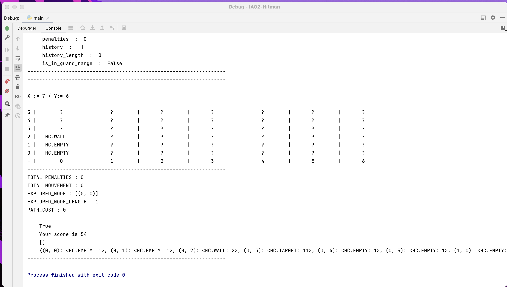
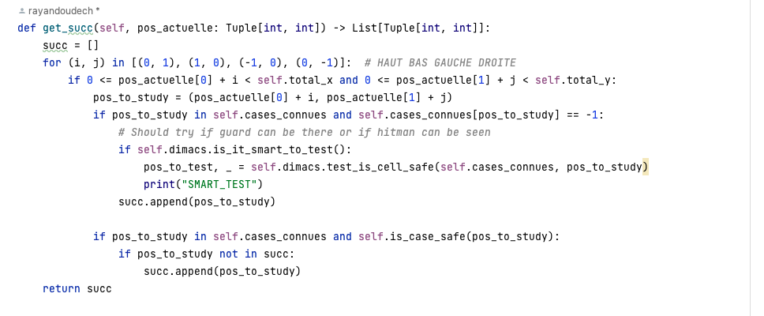

# IA02 - Hitman Solver

## Introduction

Dans le cadre du projet IA02, nous devons réaliser une simulation du jeu Hitman dans lequel le héros éponyme doit éliminer une cible en évitant de se faire repérer par les gardes. Pour ce faire, nous divisons notre travail en deux phases, la première dans laquelle nous devons explorer la carte pour en avoir une vision globale et une deuxième dans laquelle nous allons tuer la cible avec le chemin le plus optimal possible.

Le sujet du projet peut être trouvé ici : 


<div style="text-align: center;"> 
    <p style="font-size: 0.8rem; margin-top: 4vh"> Par <a href="https://github.com/RayanDoudech" target="_blank" style="color: darkred">DOUDECH Rayen</a> et <a href="https://github.com/bsellier" target="_blank" style="color: darkred">Sellier Barnabé</a> dans le cadre de l'UV IA02 en P23.</p>
</div>


## Lancement du programme

Il suffit d'éxecuter la commande ```python3 main.py [SAT|NO-SAT] [args] ```
Les arguments sont les suivants:
````
    Options:
        NO-SAT : Désactive l'utilisation du solver SAT
        SAT : Active l'utilisation du solver SAT
    Args:
        --h : affiche ce help
        --debug : Active le mode debug, par défaut le mode est désactivé
````
### ATTENTION : 
Des solvers Gophersat sont nécessaires pour lancer le programme, des solvers sont disponibles dans le dossier ```solvers/gophersat/```, si vous souhaitez utiliser votre propre solver, veuillez suivre les instructions suivantes :
Prière d'intégrer votre propre version du solver gophersat dans le dossier ````solvers/gophersat````, Puis de modifier la variable ```chemin_solver = "./solvers/gophersat/"``` à la ligne 587 dans le fichier ```dimacs.py```


## Architecture du code

Le projet est divisé en plusieurs classes : Dimacs, Joueur et Explorateur.
La classe Joueur est appelée directement dans main et permet de lancer les différentes phases. Lors de la phase 1 elle fait appel à Explorateur et Dimacs pour explorer la map, et dans la phase 2 elle fait uniquement appel à Explorateur pour calculer le meilleur chemin possible.

On peut voir Joueur comme le cerveau du programme, c'est lui qui gère la planification autant pour la phase 1 et la phase 2. Explorateur quant à lui peut être vu comme un bras de l'IA, il est chargé de faire les actions que Joueur lui demande, comme se déplacer, tourner vers la bonne direction, nous transmettre ses connaissances pour trouver le plus court chemin, etc.

Pour les 2 phases, nous utilisons une structure de PriorityQueue en utilisant les heapq, ceci nous permet de stocker de la manière la moins chère possible les cases à explorer. Nous utilisons aussi une structure de Dictionary pour stocker les informations sur les cases que nous avons déjà explorées. Nous aurions pu par exemple utiliser un Set ce qui aurait été moins chère, mais nous ne connaissions pas les Sets lorsque nous avons commencé ce projet. La structure de la PriotiyQueue a été trouvé sur un tutoriel sur internet puis adapté dans le cadre de notre projet, nous avons essayé plusieurs structures et c'est la plus performante que nous avons trouvé (au niveau de la complexité temporelle).

## Phase 1


Nous avons des variables booléennes qui nous permettent de modéliser qu'une case contient un Garde / Wall / Invité, ... Nous avons choisi de ne considérer qu'un type de garde et qu'un type d'invités étant donné qu'avec le Noise, nous ne pouvions pas découvrir leur orientation. On a donc ``` Nombre de variables = (total_x - 1) * total_x * 13 + total_y * 13 + 1 ```

Pour la phase 1 nous voulions utiliser la logique du premier ordre avec un solveur SAT. Nous l'avons implémenté à travers la classe Dimacs disponible dans `dimacs.py`. Elles possèdent plusieurs fonctions qui permettent d'initialiser les contraintes, tel que `create_piano_wire_constraint()` ou `create_cell_constraints()`. Les contraintes sont ajoutées dans le fichier dimacs grâce aux fonctions `dimacsToString()` et `dimacsToFile()` qu'on résout avec gophersat.
Pour gérer le bruit, nous avons utilisé `au_moins()` qui permet de rajouter la contrainte qu'au moins n (>= 5) gardes ou civils sont présent autour de nous. Avec un bruit inférieur à 5 et supérieur à 0 nous utilisons `exactement()` qui utilse `au_moins()` et `au_plus()`. Quand le bruit est à zéro,nous savons alors qu'il n'y a aucun garde ou civil aux alentours, nous rajoutons donc les contraintes correspondantes. Avec tout cela nous obtenons un fichier dimacs qui contient plus de 130 000  clauses.
Nous utilisons aussi un algorithme d'exploration en python, à partir duquel nous déclenchons des tests d'hypothèse, comme sur la présence d'un garde sur une case. Nous rajoutons la négation de l'hypothèse dans les clauses et si le solveur nous renvoie nous renvoie UNSAT c'est que l'hypothèse est vraie.
Malheuresement, le solveur ne nous renvoie jamais de résultats intéressants et nous devons passer majoritairement par la fonction d'exploration.

Notre algorithme d'exploration quant à lui peut être considéré comme un algorithme de recherche du plus court chemin à fixation d'étiquette. Il calcule à chaque itération les plus proches cases visitables graçe à ce qu'il connait à un instant T. Pour chaque case, l'algorithme essaye de voir si il y'a un chemin (S'il y a des cases qui ne sont pas découvertes sur le chemin, l'algorithme suppose qu'il n'y a ni wall ni garde, que c'est une case safe, c'est une théorie dans la recherche de chemin que nous avons vu sur YouTube et il s'avère que c'est la plus fructueuse).

À chaque itération nous savons donc quels sont les cases les plus proches à découvrir qui nous coûtent le moins cher. 

Supposons la map d'example, notre algorithme utilise l'exploration illustrée ci-jointe :

<div style="display :flex; align-items : center; justify-content: center">

</div>
<div style="display :flex; align-items : center; justify-content: center">
<p style="text-align: center">
Il découvre d'abord la case de la target puis il découvre la droite de la map, ce qui est le plus judiceux.
</p>
</div>

### Lien avec la RO

Dans la phase 1 on peut voir un lien évident avec ce qu'on fait en RO03, notre A* est notamment un mélange entre ce qu'on a vu en IA02 lors des TD et de l'algorithme de FORD pour la recherche du plus court chemin étudié en RO03, c'est la structure d'algorithme la plus efficace que nous avons pu trouver.

## Pistes d'amélioration de la phase 1

Pour augmenter le score nous avons essayé différentes stratégies, avec lesquels nous obtenions des scores différents.
Nous avons utilisé plusieurs map customs dont les heuristiques étaient plus adaptées à certaines qu'à d'autres. Par exemple, la distance de Manhattan donne un très bon score pour le world_example fournit de base, mais donne un très mauvais score sur les autres maps.
Finalement nous avons choisi l'heuristique qui donnait le meilleur score moyen sur toutes nos maps, cette heuristique est simplement le calcul du chemin donnant le moins de pénalités.

<div style="display :flex; align-items : center; justify-content: center">

</div>
<div style="display :flex; align-items : center; justify-content: center">
<p style="text-align: center">
On voit ici que l'heursitique de manhattan était plus intéressante sur la map d'exemple. Afin de choisir la meilleure heuristique, nous avons donc testé sur plusieurs maps. (Les listes des maps sur lesquelles nous avons testé sont disponibles dans le fichier hitman/hitman.py ). <br>
</p>
</div>
Une autre astuce, pour avoir un meilleur score, nous aurions pu simplement ne pas découvrir toutes les cases, puisque la baisse de score infligée par des mauvaises suppositions est plus faible que les pénalités engendrées par les mouvements et les gardes par exemple. Mais nous avons jugé que ce n'était pas l'optique du projet donc nous avons favorisé la découverte des cases.
<div style="display :flex; align-items : center; justify-content: center">

</div>
<div style="display :flex; align-items : center; justify-content: center">
<p style="text-align: center">
On voit sur cette capture d'écran qu'en ne pas devinant la map sur la map d'example, on a un score supérieur à si l'exploration avait été effectuée.
</p>
</div>

Nous avons également essayé de tester la fiabilité des successeurs d'une case pour éviter de prendre un chemin où l'on se ferait repérer par un garde.
Nous avons essayé d'utiliser le solver SAT à l'étude de chaque successeur (Cf. Capture d'écran suivante, print("Smart Test"), c'était à cet endroit qu'on utilisait le solver au début), étant donné les contraintes, le solver était censé nous répondre correctement, mais le problème étant que le temps de résolution était beaucoup trop long. Nous avons abondonné cette technique. Nous avons essayé une autre approche qui était d'étudier les cas en 5x5, il s'avère que c'est la plus intréssante et dans quelques cas précis, le SAT peut répondre et deviner un garde. On en conclut que notre solver fonctionne, néanmoins je pense qu'il est trop lent pour être utilisé à l'étude de chaque successeur dans le cadre de l'implémentation de notre algorithme pour ce projet. Pour diminuer le temps de calcul et le recours au SAT, l'étude se fait uniquement sur la prochaine case à visiter et non sur tous les successeurs de chaque case.
<div style="display :flex; align-items : center; justify-content: center">

</div>

## Phase 2

Pour la phase 2, nous utilisons un algorithme d'exploration A-Star qui calcule les différents chemins possibles et nous donne celui avec les pénalitées les moins élevées. Nous calculons par exemple si il est plus optimisé de d'aller prendre le costume ou d'aller tuer la cible sans. Pour cela nous disposons de la classe Explorateur dont les fonctions principales sont `move_to_goal()` qui permet de se déplacer d'un point A à un point B, `valuate_path()` qui évalue le coût d'un chemin en comptant le nombre de pénalités obtenues par celui-ci. La fonction `get_best_strategy()` est la fonction qui s'occupe de réaliser cette planification

Au début de la phase 2, étant donné que nous connaissons la map nous calculons plusieurs chemins, On part de l'hypothèse de base qui dit que la map est explorable i.e il existe toujours un chemin pour atteindre les objectifs principaux (Piano_wire et target), sinon dans le cadre de ce projet, la phase 1 ne serait pas jouable :
<ul>
<li>1- Calcul chemin le moins chère en pénalités pour aller vers la piano_wire puis costume puis target - PATH 1</li>
<li>2- Calcul chemin le moins chère en pénalités pour aller vers le costume puis piano_wire puis target - PATH 2</li>
<li>3- Calcul chemin le moins chère en pénalités pour aller vers la piano_wire puis target - PATH 3</li>
<li>4- Vérification de l'existence d'un des cas puis choix de la meilleure option (la moins chère)</li>
<li>5- Calcul chemin en pénalités pour aller depuis target vers (0, 0)</li>
</ul>

Nous comparons enfin tous ces chemins pour en déduire le moins cher en pénalités et nous l'exécutons. Cette stratégie (même si est plus lourde en complexité spatiale et temporelle) nous permet d'obtenir un score plus intéressant.

#### Modélisation STRIPS

La modélisation STRIPS est décrite dans strips.md.

## Piste d'amélioration phase 2 

Nous aurions pu améliorer la phase 2, en supposant par exemple la recherche de chemin intéressant ou le meurtre des invités ou des gardes nous aurait permis de faire moins de pénalités. Nous n'avons pas eu le temps de l'implementer. 


## Conclusion

A travers les différents concepts étudiés en IA02, nous avons pu déterminé les meilleurs mouvements à effectuer. Cepandant, il reste encore une marge d'amélioration, au niveau du SAT et de l'exploration qui nous auraient permis d'obtenir un score encore meilleur. Nous sommes cependant fières du rendus final et nous avons appris beaucoup de choses sur les algorithmes de recherche et de planification. Ce projet a été aussi une occassion pour nous de nous améliorer sur le python et de solidifier notre compréhension des concepts vus en TP. Nous avions déjà quelques connaissances en python, mais nous n'utilisions pas par exemple les typages de variables de manière automatiques, étant donné que nous avons été obligé de par la consigne à le faire, nous nous sommes améliorés. Nous avons testé pylint par exemple sur notre code et nous avons le score de 7,59 / 10 pour joueur.py, 7.11/10 pour dimacs.py et 7.38 pour explorateur.py ce qui est globalement un très bon score.